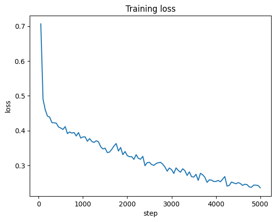

# Qwen2.5-Math Fine-Tuning on GSM8K

Этот проект посвящён дообучению модели **Qwen/Qwen2.5-Math-1.5B** на датасете **GSM8K** с использованием библиотеки **Transformers** и подхода **LoRA (PEFT)**. Работа выполнена в **Google Colab Pro**.

## Структура ноутбука

1. **Установка библиотек** – установка необходимых зависимостей.
2. **Импорты** – подключение модулей для работы с моделью и данными.
3. **Основная часть** – загрузка, токенизация, настройка и обучение модели, сохранение результатов.
4. **Тестирование модели** – загрузка обученной модели и проверка на тестовых примерах.

## Основные шаги

### Конфигурация

* Используется модель: `Qwen/Qwen2.5-Math-1.5B`
* Датасет: `openai/gsm8k` (configs: `main`, `socratic`)
* Параметры обучения:

  * `max_steps = 5000`
  * `per_device_train_batch_size = 2`
  * `learning_rate = 3e-5`
  * `LoRA: r=16, alpha=32, dropout=0.1`
  * Целевые слои: `q_proj`, `v_proj`, `k_proj`, `o_proj`, `gate_proj`, `up_proj`, `down_proj`

### Основные библиотеки

* `transformers`
* `datasets`
* `trl`
* `peft`
* `bitsandbytes`
* `matplotlib`

### Загрузка и подготовка данных

* Подключение к Google Drive:

```python
from google.colab import drive
drive.mount('/content/drive')
OUTPUT_DIR = "/content/drive/MyDrive/Qwen"
SAVE_DIR = "/content/drive/MyDrive/Qwen_full"
```

* Токенизация данных, маскирование части токенов (чтобы модель училась только на ответах).

### Обучение

* Настройка `SFTTrainer` для дообучения с использованием LoRA.
* Обучение проводится в 8-битном режиме (при наличии поддержки `bitsandbytes`).
* После обучения LoRA-адаптеры мёрджатся в базовую модель и сохраняются.


### Тестирование

* Загружается объединённая модель из `SAVE_DIR`.
* Генерируются ответы на несколько задач из тестового сплита GSM8K.
* Результаты сравниваются с эталонными ответами.

## Как использовать

1. Откройте ноутбук в **Google Colab**.
2. Установите зависимости:

```bash
!pip install transformers datasets accelerate trl peft bitsandbytes safetensors evaluate matplotlib
```

3. Укажите пути для сохранения модели на Google Drive:

```python
OUTPUT_DIR = "/content/drive/MyDrive/Qwen"
SAVE_DIR = "/content/drive/MyDrive/Qwen_full"
```

4. Запустите все ячейки последовательно.

## Выходные данные

* **Папка с LoRA-адаптерами**: `OUTPUT_DIR`
* **Объединённая модель**: `SAVE_DIR`
* График изменения функции потерь.

## Ссылка на дообученную модель

[Google Drive](https://drive.google.com/drive/folders/108qDzPK7Bf7fJEdBJG8rhklCYL_A_fjB?usp=sharing)

## Контакты

При возникновении вопросов:

* Telegram: **@bez_organov**
